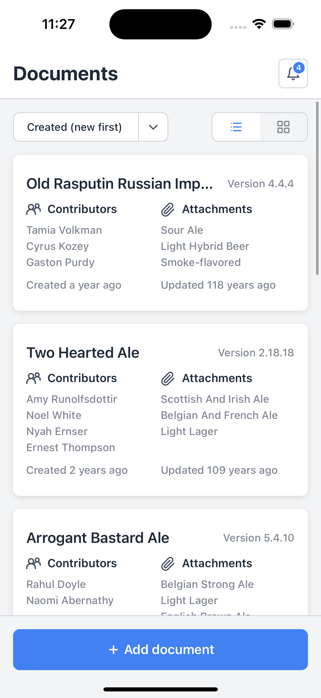
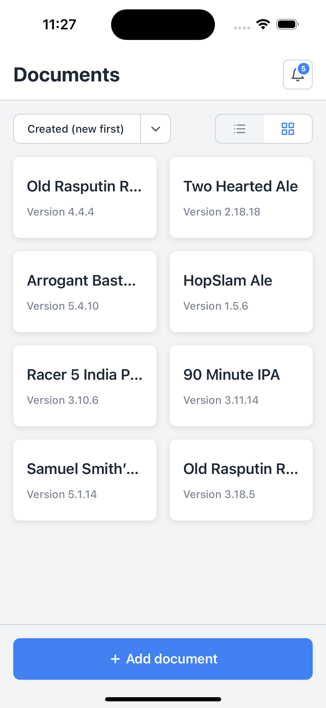
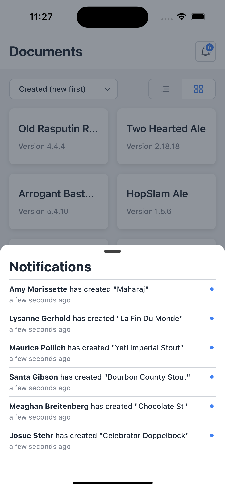
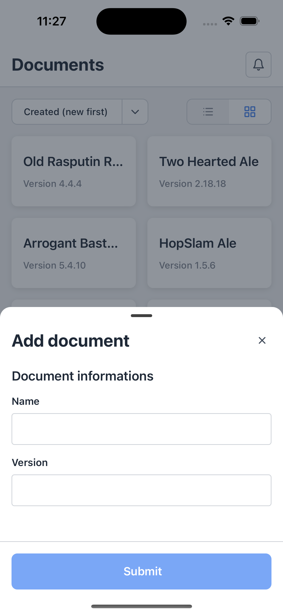

# React Native Code Challenge

The goal of this challenge is to create a simple React Native app that displays a list of documents, and allows the user to create new ones. Also the app receives real time notifications through a socket connection. The app should be able to run on both iOS and Android.

If you want to get access to the server, please contact me.

## Implemented libraries
- [Reanimated](https://docs.swmansion.com/react-native-reanimated/)
- [react-native-safe-area-context](https://github.com/th3rdwave/react-native-safe-area-context)
- [react-native-element-dropdown](https://github.com/hoaphantn7604/react-native-element-dropdown)
- [dayjs](https://day.js.org/)
- [@gorhom/bottom-sheet](https://gorhom.github.io/react-native-bottom-sheet/)
- [Among extra libraries provided by React Native such as **eslint**, **prettier**, **babel**, **metro**, and **typescript**.](https://reactnative.dev)

- Test hasn't been implemented.

## Run the app

- Clone the repo
- Run `yarn` to install dependencies
- Go to `ios` folder (if you are using macOS) and run `pod install` (if you are running an M1 Mac, please run `arch -x86_64 pod install` instead)
- Run `yarn ios` or `yarn android` to run the app. (if you are running an M1 Mac, please run `arch -x86_64 yarn ios` instead).

## Screenshots

https://user-images.githubusercontent.com/22961489/191470605-6e2dd9bc-e524-45ea-8017-782eebee672c.mp4

